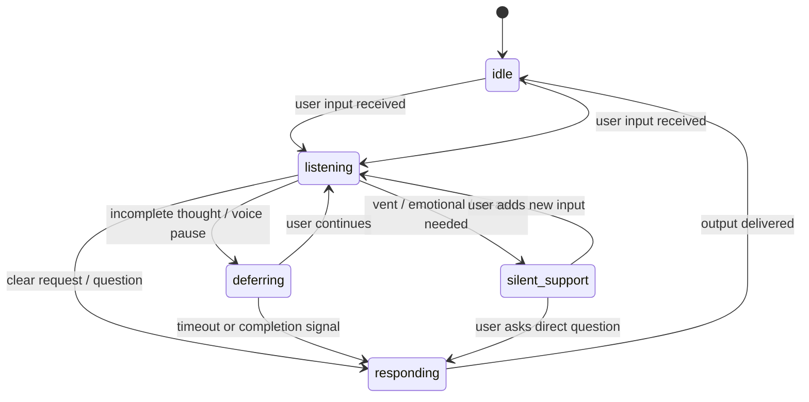

# Behavior Engine — Specification v1.3 (Locked)

**Status:** v1.3 — behavior layer locked · safe for ARCHITECTURE.md  
**Terakhir diperbarui:** 2026-08-26  
**Referensi:** [VISION.md](VISION.md)  
**Changelog v1.3:** Objective Arbitration · Arc Decay · Stability Constraints · CQF calibration note

---

## One line

Behavior Engine = micro + macro + quality feedback + **arbitration** — sistem yang resolve konflik antar-objective dan output **satu Behavior Directive Vector** stabil, bukan kumpulan sinyal yang saling tarik.

---

## Layer stack (v1.3)

| Layer | Komponen |
|-------|----------|
| Macro | Conversation Arc + **decay dynamics** (§8.6) |
| Micro | State, pressure, silence, inertia |
| Objectives | CQF · CPS · pressure · arc continuity |
| **Meta** | **Objective Arbitration** (§16) + **Stability** (§17) |
| Output | **BehaviorDirectiveVector** (§18) |

> v1.2 gap: CQF vs CPS vs arc bisa konflik → assistant terlalu diam / terlalu hati-hati.  
> v1.3 fix: arbitration + stability floor/ceiling + arc decay (bukan UI bar statis).

---

## Arsitektur (5 blok)

```
┌──────────────────────────────────────────────────────────────┐
│  FEEDBACK — CQF · CPS · arc update · decay (§8.6)            │
└────────────────────────────▲─────────────────────────────────┘
                             │
┌────────────────────────────┴─────────────────────────────────┐
│  EXECUTION — LLM / silence / defer from BDV (§18)              │
└────────────────────────────▲─────────────────────────────────┘
                             │
┌────────────────────────────┴─────────────────────────────────┐
│  META — Objective Arbitration (§16) + Stability (§17)          │
│  resolve CQF ↔ CPS ↔ pressure ↔ arc → single directive         │
└────────────────────────────▲─────────────────────────────────┘
                             │
┌────────────────────────────┴─────────────────────────────────┐
│  DECISION LOOP — interpret → pressure → inertia → softmax      │
└────────────────────────────▲─────────────────────────────────┘
                             │
┌────────────────────────────┴─────────────────────────────────┐
│  MACRO — Conversation Arc Memory (§8)                          │
└────────────────────────────────────────────────────────────────┘
```

---

## 1. Conversation State Machine



State → `SessionBehaviorState` (micro, per session).  
Arc → `ConversationArc` (macro, same session — §8).

---

## 2. Decision Loop (v1.3)

```
INPUT
  │
  ▼
[0] LOAD ARC ──────── ConversationArc + apply decay (§8.6)
  │
  ▼
[1] INTERPRET ─────── intent depth, emotional_load
  │
  ▼
[2] PRESSURE ──────── ContextPressureScore (§3)
  │
  ▼
[3] INERTIA ───────── P_continue, P_stop (§5)
  │
  ▼
[4] STATE ─────────── update FSM
  │
  ▼
[5] SOFTMAX ───────── action probabilities (§6) — candidate only
  │
  ▼
[6] OBJECTIVE VECTORS ─ compile competing preferences (§16.2)
  │
  ▼
[7] ARBITRATE ─────── OAL + stability guards (§16, §17) → BDV
  │
  ▼
[8] SILENCE TYPE ──── if silent: taxonomy (§4)
  │
  ▼
EXECUTE → output
  │
  ▼
[9] CQF + CPS ─────── post-turn scoring (§9, §10)
  │
  ▼
[10] ARC UPDATE ───── persist + decay tick (§8.5, §8.6)
  │
  ▼
OUTPUT: BehaviorDirectiveVector + QualitySnapshot
```

### Step 1 — Intent interpretation

```yaml
IntentInterpretation:
  surface_type: statement | question | ack | vent | command | backchannel
  depth: none | shallow | moderate | deep
  requires_response: bool
  incompleteness: complete | likely_continues | truncated
  emotional_load: low | medium | high    # 0.2 / 0.5 / 0.8
  is_rhetorical: bool
  directness: explicit_request | implicit_need | no_ask
```

| depth | intent_need |
|-------|-------------|
| none | 0.0 |
| shallow | 0.25 |
| moderate | 0.6 |
| deep | 0.9 |

---

## 3. Context Pressure Formula

### 3.1 Dimensi

```yaml
ContextPressureScore:
  urgency: float              # U
  emotional_intensity: float  # E
  conversational_momentum: float  # M
  user_expectation: float     # X
  assistant_load: float       # A
```

### 3.2 Formula per dimensi

**Urgency (U):**
```
U = clamp(0.5*is_direct_question + 0.3*is_command + 0.2*policy_must_respond + 0.1*intent_need, 0, 1)
```

**Emotional intensity (E):**
```
E = clamp(0.6*emotional_load_numeric + 0.3*vent_keyword_match + 0.1*exclamation_density, 0, 1)
```

**Momentum (M):**
```
M = clamp(0.4*turn_rate_score + 0.3*user_message_length_trend + 0.2*topic_continuation + 0.1*(1-closure_ack), 0, 1)
```

**User expectation (X):**
```
X = clamp(0.4*is_direct_question + 0.3*user_repeated_prompt + 0.2*silence_duration_penalty + 0.1*social_greeting, 0, 1)
```

**Assistant load (A):**
```
A = clamp(0.5*last_assistant_verbosity + 0.3*consecutive_assistant_turns/3 + 0.2*last_word_count/200, 0, 1)
```

### 3.3 Composite scores

```
speak_pressure = clamp(0.30*U + 0.15*X + 0.20*intent_need + 0.10*M
                     - 0.15*E*(1-is_direct_question) - 0.25*A - 0.20*closure_ack, 0, 1)

silence_pressure = clamp(0.25*(1-intent_need) + 0.25*E*(1-is_direct_question)
                       + 0.20*closure_ack + 0.15*A + 0.15*incompleteness_score, 0, 1)

defer_pressure = clamp(0.50*incompleteness_score + 0.30*voice_pause_signal + 0.20*(1-U), 0, 1)
```

Arc modifiers applied in §8.4 **before** softmax.

---

## 4. Silence Taxonomy

| Type | Code | Kapan |
|------|------|-------|
| Strategic | `SILENCE_STRATEGIC` | Mid-thought, incompleteness tinggi |
| Empathetic | `SILENCE_EMPATHETIC` | E > 0.7, bukan direct question |
| Cognitive | `SILENCE_COGNITIVE` | Complex Q — delay then RESPOND |
| Completion | `SILENCE_COMPLETION` | Closure ack, wind-down |
| Passive | `SILENCE_PASSIVE` | Low intent_need |
| Policy | `SILENCE_POLICY` | Policy forbid |

---

## 5. Continuation / Stop (Inertia)

```
P_continue = sigmoid(1.2*thread_open + 0.8*(intent_need-0.5) + 0.5*user_engagement
                   - 1.0*closure_ack - 0.9*assistant_just_spoke_long - 0.7*A)

P_stop = clamp(0.35*closure_ack + 0.25*(depth==none) + 0.20*A
             + 0.15*(1-thread_open) + 0.05*(E>0.6 AND NOT direct_question), 0, 1)

should_stop = P_stop > 0.55 OR P_continue < 0.30
```

Unprompted continuation: requires `P_continue > 0.75 AND thread_open AND implicit_need`.

---

## 6. Decision Tree + Probabilistic Resolution

```
logit_RESPOND  = 2.0*speak_pressure + 1.5*intent_need + 3.0*policy_must_respond + arc_speak_bias
logit_ACK_ONLY = 1.5*E + 0.8*(1-intent_need) + 0.5*silent_support_state + arc_warmth_bias
logit_SILENCE  = 2.0*silence_pressure + 1.0*closure_ack + arc_wind_down_bias
logit_DEFER    = 2.5*defer_pressure

P(action) = softmax(logits)  → argmax (test) | sample_tempered T=0.7 (prod)
```

**Arc bias examples (§8.4):**
- `arc_phase=winding_down` → `arc_wind_down_bias += 0.8` on SILENCE logit
- `cqf_rolling < 0.5` → reduce RESPOND logit by 0.3, boost ACK/SILENCE
- `cps_streak >= 2` → boost SILENCE logit by 0.5

---

## 7. Reasoning — INTERNAL ONLY

```yaml
BehaviorReasoning:
  visibility: internal    # NEVER user-facing, NEVER in LLM prompt
  primary_reason: string
  reason_codes: string[]
  pressure_snapshot: ContextPressureScore
  arc_snapshot: ConversationArcSummary
  action_probabilities: { ... }
  confidence: float
```

---

## 8. Conversation Arc Memory (macro intelligence)

**Bukan** memory engine (facts tentang user). Arc = **trajectory percakapan** — bagaimana hubungan & energi evolve antar turn.

### 8.1 Schema

```yaml
ConversationArc:
  session_id: uuid
  turn_count: int

  arc_phase: opening | exploration | deepening | resolution | winding_down

  emotional_trajectory: float[]     # E per turn, max 20 retained
  emotional_drift: float              # ΔE smoothed; + = escalating, − = calming
  emotional_baseline: float           # session average E

  relational_warmth: float          # 0–1, builds slowly; decays on CPS hits
  trust_signal: float                 # 0–1; drops on chatbot patterns

  topic_threads:
    - id: string
      status: open | resolved | abandoned
      turns_active: int

  user_effort_score: float          # 0–1; 1 = user struggling (repeats, "gimana ya")
  closure_attempts: int             # user "oke"/"thanks" count in window

  quality_rolling:
    cqf: float                        # EWMA of composite CQF
    cps: float                        # EWMA chatbot penalty
    cps_streak: int                   # consecutive turns CPS > 0.4

  last_decisions: []                  # last 5 speak actions — pattern detection
```

### 8.2 Arc phase transitions

```
opening        → exploration     : turn_count >= 2 OR depth >= shallow
exploration    → deepening       : emotional_drift > 0.15 OR thread_open > 1 turn
deepening      → resolution      : direct_question + intent_need >= 0.6 answered
resolution     → winding_down    : closure_attempts >= 1 OR P_stop > 0.6
winding_down   → exploration     : new topic OR depth >= moderate after 2+ silent turns
any            → deepening       : E spike > baseline + 0.25
```

### 8.3 Emotional drift & relational continuity

**Emotional drift** (updated each turn):
```
emotional_drift = EMA( E_current - E_previous , alpha=0.4 )
```

**Relational warmth** (slow build, fast drop on chatbot):
```
Δwarmth = +0.03 if (ACK_ONLY or SILENCE_EMPATHETIC) AND E > 0.5
        + 0.05 if emotional_alignment > 0.7 in CQF
        - 0.15 if chatbot_penalty > 0.5
        - 0.08 if RESPOND when silence_pressure > 0.6  # "should have been quiet"

relational_warmth = clamp(relational_warmth + Δwarmth, 0, 1)
```

Then apply **decay tick** each turn — §8.6.

**Relational continuity rules:**

| Signal | Arc effect |
|--------|------------|
| User returns after vent (same session) | Don't reset to `opening` — keep warmth |
| Assistant ignored user emotional peak | `trust_signal -= 0.1` |
| Consistent ack-without-question on vents | `trust_signal += 0.05` per vent handled well |
| 3+ turns assistant-dominated | `arc_phase` bias → `winding_down` |

### 8.4 Arc → objective preferences (pre-arbitration)

Arc no longer directly mutates logits. It emits **preference vectors** consumed by OAL (§16):

```yaml
arc_preferences:
  winding_down:
    speak_bias: -0.25
    engagement_cap: 0.4

  deepening + emotional_drift > 0.2:
    tone_bias: WARMER
    question_budget: 0

  cqf_rolling < 0.45:
    speak_bias: -0.30        # wants quieter — may conflict with urgency

  cps_streak >= 2:
    speak_bias: -0.40        # wants quieter — may conflict with questions

  relational_warmth > 0.6:
    engagement_floor: 0.35
    tone_bias: WARMER
    delay_ms_factor: 0.85
```

### 8.5 Arc update (post-turn)

After CQF + CPS computed:

```
push E to emotional_trajectory
recompute emotional_drift, emotional_baseline
update arc_phase via transition rules
update topic_threads (open/resolve)
increment closure_attempts if closure_ack
update quality_rolling (EWMA alpha=0.35)
append last_decisions
persist ConversationArc to session store
```

### 8.6 Arc decay & recovery dynamics

Arc values **bukan bar statis**. Tanpa decay/recovery → terasa "game UI", bukan manusia.

```yaml
ArcDecayConfig:
  warmth_half_life_turns: 12       # τ_w
  warmth_baseline: 0.40            # natural resting warmth
  trust_recovery_rate: 0.04        # per clean turn (no CPS hit)
  trust_drop_multiplier: 1.0       # × cps on slip
  emotional_volatility: 0.35       # amplifies drift sensitivity
  thread_abandon_after_turns: 5    # open → abandoned
  turns_since_interaction: int     # tracked per arc
```

**Warmth decay** (applied at [0] LOAD ARC, each turn):
```
warmth_decayed = warmth_baseline
               + (warmth - warmth_baseline) * exp( -ln(2) * Δt / τ_w )
```
`Δt` = turns since last meaningful exchange (ack/vent/respond counts; pure defer does not reset).

Event deltas (§8.3) apply **after** decay, same turn.

**Trust recovery / drop** (asymmetric — drop fast, recover slow):
```
IF cps_turn > 0.4:
  trust = max(0, trust - 0.15 * cps_turn * trust_drop_multiplier)
ELSE IF cps_turn < 0.2:
  trust = min(1, trust + trust_recovery_rate)

# trust is NOT linear — single CP1 can wipe 3 turns of recovery
```

**Emotional volatility** — drift destabilizes phase, not just tone:
```
effective_drift = emotional_drift * (1 + emotional_volatility * |emotional_drift|)

IF |effective_drift| > 0.25:
  arc_phase_transition_threshold *= 0.8   # easier to enter deepening
```

**Topic thread decay:**
```
IF thread.turns_active > thread_abandon_after_turns AND no user mention:
  thread.status = abandoned
```

---

## 9. Conversation Quality Function (CQF)

**Proxy success function** — bukan truth signal langsung dari user.

> ⚠️ **Calibration warning:** N, S, F, A adalah proxy. Tanpa kalibrasi data interaksi nyata (human eval, thumbs, abandon rate), sistem bisa **optimize terlihat bagus di spec** tapi terasa "terlalu rapi / controlled".  
> v1: CQF drives **internal tuning only**. `external_truth_weight = 0` until eval pipeline exists (ROADMAP).

### 9.1 Metrics (per turn)

```yaml
ConversationQualityMetrics:
  naturalness: float           # N  0–1
  smoothness: float            # S  0–1
  user_effort_min: float       # F  0–1  higher = less burden on user
  emotional_alignment: float   # A  0–1
  chatbot_penalty: float       # P  0–1  from CPS §10 — subtracted
```

### 9.2 Metric formulas

**Naturalness (N)** — action fit context:
```
N = clamp(
  0.30 * action_context_match      # SILENCE when silence_pressure high, etc.
+ 0.25 * (1 - verbosity_mismatch)  # MINIMAL when should_stop
+ 0.25 * appropriate_silence_type   # 1 if silence_type matches trigger
+ 0.20 * (1 - unnecessary_llm)     # 1 if LLM skipped when defer/silence correct
, 0, 1)
```
`action_context_match`: 1.0 if argmax(P(action)) == action taken AND pressure aligned

**Smoothness (S)** — no jarring transitions:
```
S = clamp(
  0.35 * (1 - phase_transition_jarring)   # e.g. EXPAND after SILENCE_COMPLETION
+ 0.35 * turn_length_consistency
+ 0.30 * (1 - tone_whiplash)              # WARMER → cold formal jump
, 0, 1)
```

**User effort minimization (F):**
```
F = clamp(
  0.40 * (1 - unsolicited_questions_count / max(1, allowed))
+ 0.30 * (1 - user_repeat_detected)       # user had to re-ask
+ 0.30 * (1 - overlong_response_penalty)   # word count vs length constraint
, 0, 1)
```

**Emotional alignment (A):**
```
A = clamp(
  0.40 * tone_match_emotional_load        # SOFTER/WARMER when E high
+ 0.35 * (1 - solutionizing_on_vent)       # penalize advice on vent
+ 0.25 * presence_without_interrogation    # ack without "why?"
, 0, 1)
```

### 9.3 Composite CQF

```
CQF = clamp(
  0.25*N + 0.25*S + 0.20*F + 0.20*A - 0.35*P
, 0, 1)
```

Session rolling:
```
cqf_rolling = EMA(CQF_turn, alpha=0.35)
```

### 9.4 CQF as feedback into decisions

| CQF / rolling | Next-turn bias |
|---------------|----------------|
| Turn CQF < 0.4 | Log decision for review; arc `cps_streak` risk |
| Rolling < 0.45 | Quieter mode (§8.4) |
| Rolling > 0.75 | Maintain current strategy; slight warmth + |
| N < 0.3 on vent turn | Force review: was RESPOND when should ACK? |

CQF **tidak** langsung override action same turn — feeds arc preferences for turn+1. **All CQF/CPS biases pass through OAL (§16)** — never applied raw.

### 9.5 Quality targets (v1 — proxy benchmarks, not production KPIs)

| Context | Min CQF |
|---------|---------|
| Vent handled | ≥ 0.65 |
| Closure "oke" | ≥ 0.70 (silence = success) |
| Direct question | ≥ 0.60 |
| Session average (10+ turns) | ≥ 0.55 |

---

## 10. Chatbot Penalty System (CPS)

**Bukan hanya rule boolean** — scored anti-patterns that feed CQF and arc.

### 10.1 Pattern score table

Each detected pattern adds to `chatbot_penalty` P ∈ [0, 1] (capped):

| ID | Pattern | Score | Detection |
|----|---------|-------|-----------|
| CP1 | Closing offer ("ada lagi?") | 0.85 | regex + semantic |
| CP2 | Unsolicited multi-option menu | 0.75 | list without request |
| CP3 | Question after vent | 0.70 | vent turn + `?` in output |
| CP4 | Always-respond on ack | 0.65 | RESPOND on depth=none ack |
| CP5 | "Sebagai AI..." | 0.90 | phrase match |
| CP6 | Unsolicited recap | 0.55 | "jadi yang kamu maksud" |
| CP7 | Over-length vs constraint | 0.50 | word_count > 2× limit |
| CP8 | Emoji enthusiasm spike | 0.40 | emoji after neutral input |
| CP9 | Symmetrical bullet answer | 0.45 | bullets on MINIMAL turn |
| CP10 | Re-ask already answered | 0.60 | memory overlap (defer to memory engine v2) |

```
P = clamp( Σ pattern_score * detected , 0, 1 )
```

### 10.2 Behavioral trajectory penalty

Session-level — penalizes **patterns across turns**:

```
trajectory_penalty = clamp(
  0.20 * consecutive_RESPOND_on_low_intent
+ 0.25 * (closure_attempts >= 2 AND still questioning)
+ 0.15 * assistant_turn_ratio > 0.6
, 0, 1)

P_total = clamp(P + 0.5 * trajectory_penalty, 0, 1)
```

### 10.3 CPS → consequences

| P_total | Action |
|---------|--------|
| < 0.2 | Log only |
| 0.2–0.4 | CQF reduced; arc warmth −0.05 |
| 0.4–0.6 | `cps_streak++`; arc preference quieter — **via OAL, not raw** |
| > 0.6 | Policy rewrite trigger; arc `trust_signal -= 0.15` |
| > 0.8 | Block output; fallback template ack or silence |

AC1–AC8 from v1.0 remain **hard blocks** at > 0.8. CPS adds **gradient** below hard block.

---

## 16. Objective Arbitration Layer (OAL)

**Meta decision resolver.** Menggabungkan objective yang bisa konflik menjadi **satu Behavior Directive Vector**.

### 16.1 Known conflicts

| Conflict | Risk if unarbitrated |
|----------|------------------------|
| CQF wants silence · urgency wants RESPOND | User ignored on direct Q |
| CPS wants mute · arc wants warmth | Cold, absent assistant |
| Arc winding_down · user new deep topic | Thread feels dead |
| CPS streak · user repeats question | Excessive caution loop |

### 16.2 Competing objective vectors

Each source emits `ObjectivePreference`:

```yaml
ObjectivePreference:
  source: pressure | cqf | cps_avoid | arc | policy | stability
  speak_affinity:   { RESPOND, ACK_ONLY, SILENCE, DEFER }  # 0–1 each, sum≠1
  engagement_level: float    # 0=absent, 1=fully present
  question_budget:  int       # max questions this turn
  verbosity_cap:    MINIMAL | NORMAL | EXPAND
  tone_bias:        STABLE | WARMER | SOFTER | MATCH_USER
  weight: float              # source priority this turn
```

**Compile from subsystems:**

```
pressure_pref  ← softmax P(action) mapped to speak_affinity; weight = 0.35 base
cqf_pref       ← if cqf_rolling < 0.45: bias SILENCE/ACK; weight = 0.20
cps_avoid      ← if cps_streak >= 1: reduce RESPOND; weight = 0.15 + 0.10*streak
arc_pref       ← from §8.4; weight = 0.25
policy_pref    ← must_respond: RESPOND=1.0; weight = 1.0 (hard override tier)
stability_pref ← from §17; weight = 1.0 (hard guard tier)
```

### 16.3 Arbitration algorithm

```
TIER 0 — Hard (non-negotiable):
  policy.must_respond           → speak=RESPOND, engagement≥0.6
  stability.min_engagement      → floor when direct_question
  stability.silence_ratio_cap   → ceiling on SILENCE streak

TIER 1 — Urgency override:
  IF U > 0.7 AND is_direct_question:
    pressure_pref.weight += 0.40   # CQF/CPS quieter bias capped (§17)

TIER 2 — Weighted merge (remaining):
  merged_affinity[a] = Σ (weight_s * speak_affinity_s[a]) / Σ weight_s
  speak = argmax(merged_affinity)

TIER 3 — Engagement & style resolve:
  engagement = clamp(weighted_mean(engagement_level), stability_floor, 1)
  question_budget = min across sources with question_budget=0, else 1
  verbosity_cap = min verbosity across caps (MINIMAL < NORMAL < EXPAND)
  tone = highest-weight tone_bias wins unless conflict → MATCH_USER
```

### 16.4 Conflict log (internal)

```yaml
ArbitrationRecord:
  conflicts:
    - { a: cqf_pref, b: pressure_pref, resolution: "urgency_tier1", winner: pressure }
    - { a: cps_avoid, b: stability, resolution: "min_engagement_floor", winner: stability }
  winner_tier: policy | stability | urgency | weighted
  merged_affinity: { RESPOND: 0.22, ACK_ONLY: 0.51, ... }
```

---

## 17. Stability Constraints

Prevent runaway feedback — **over-silence**, **over-apology**, **caution loop**.

```yaml
StabilityConstraints:
  # Silence guards
  max_consecutive_silence: 2          # unless deferring or vent arc
  silence_ratio_cap: 0.50             # max silent turns in rolling window=10
  silence_streak_current: int

  # Engagement floors
  min_engagement_on_direct_question: 0.60   # must RESPOND or ACK+, never pure SILENCE
  min_engagement_on_repeat_prompt: 0.70     # user asked twice → must answer
  warmth_floor: 0.25                  # below → boost engagement +0.20

  # Quieter-mode caps (prevent mute assistant)
  cps_speak_bias_cap: -0.30           # max suppression from CPS alone
  cqf_speak_bias_cap: -0.35           # max suppression from CQF alone
  combined_quieter_cap: -0.45         # CPS + CQF together

  # Over-apology / caution loop
  max_apology_tokens_per_session: 3   # "maaf", "sorry" template count
  caution_loop_detect:
    condition: cps_streak >= 2 AND silence_streak >= 2 AND user_spoke
    action: force ACK_ONLY minimum, engagement_floor 0.40

  # Verbosity guards
  max_expand_after_cps_streak: false  # no EXPAND if cps_streak >= 1
```

**Stability tier in OAL:** Runs at TIER 0 alongside policy.

Examples:

```
User asks direct Q, cps_streak=3, cqf_rolling=0.38:
  cps wants SILENCE (-0.40) + cqf wants SILENCE (-0.30)
  → combined would be -0.70, but combined_quieter_cap = -0.45
  → stability min_engagement_on_direct_question → RESPOND, MINIMAL, question_budget=0

3 silent turns, user: "Hello?":
  caution_loop_detect → ACK_ONLY "Iya, here." — break loop without chatbot menu
```

---

## 18. Behavior Directive Vector (BDV) — final output

Single structured output dari behavior engine ke conversation engine / LLM / personality.

```yaml
BehaviorDirectiveVector:
  # Core action
  speak: RESPOND | SILENCE | DEFER | ACK_ONLY
  silence_type: null | SILENCE_*

  # Resolved style (post-arbitration)
  engagement_level: float          # 0–1
  length: MINIMAL | NORMAL | EXPAND
  questions: NONE | CLARIFY_ONLY | ALLOWED
  question_budget: int
  interrupt: FORBIDDEN | BACKCHANNEL_OK | ALLOWED
  tone_shift: STABLE | WARMER | SOFTER | MATCH_USER
  stop_rule: ONE_TURN | UNTIL_RESOLVED
  partial_response: bool
  timing: { delay_ms: int }

  # Context carried forward
  conversation_state: idle | listening | responding | deferring | silent_support
  pressure: ContextPressureScore
  inertia: { P_continue, P_stop, should_stop }
  arc_snapshot: ConversationArcSummary

  # Meta (internal)
  arbitration: ArbitrationRecord
  reasoning: BehaviorReasoning       # internal only
  candidate_probabilities: { ... }   # pre-arbitration softmax
  resolution_mode: argmax | sample_tempered

QualitySnapshot:                     # post-turn, separate emit
  metrics: ConversationQualityMetrics
  cqf: float
  chatbot_penalty: float
  cps_streak_after: int
  arc_phase_after: string
  stability_triggers: string[]       # which guards fired
```

**Downstream contract:** Conversation engine consumes **BDV only** — tidak merge pressure/CQF/CPS sendiri.

---

## 11. Style vector

```yaml
StyleVector:
  length: MINIMAL | NORMAL | EXPAND
  questions: NONE | CLARIFY_ONLY | ALLOWED
  interrupt: FORBIDDEN | BACKCHANNEL_OK | ALLOWED
  tone_shift: STABLE | WARMER | SOFTER | MATCH_USER  # + relational_warmth bias
  stop_rule: ONE_TURN | UNTIL_RESOLVED
  partial_response: bool
  timing:
    delay_ms: int
```

---

## 12. Output contract

Superseded by **BehaviorDirectiveVector (§18)**. `StyleVector` = subset of BDV fields for personality engine.

---

## 13. Contoh — arbitration + stability trace

### Turn 3 — Vent dalam arc deepening

```
ARC IN: phase=deepening, warmth=0.52, drift=+0.18, cqf_rolling=0.61

User: "Tapi bosku mah ga ngerti deh..."

[2] E=0.72, speak_pressure=0.19, silence_pressure=0.58
[8.4] deepening + drift → questions=NONE forced, tone WARMER
[5] ACK_ONLY (P=0.71)
[9] N=0.88 S=0.82 F=0.91 A=0.85 P=0.0 → CQF=0.84
[11] warmth=0.55, trust+=0.05, phase stays deepening

OUTPUT: "Sulit ya kalau gitu."
```

### Turn 7 — Closure (arc winding_down)

```
ARC IN: phase=winding_down, closure_attempts=1, warmth=0.68

User: "Oke deh, thanks"

[8.4] wind_down → silence_pressure+0.15
[5] SILENCE_COMPLETION (P=0.89)
[9] N=0.92 S=0.90 F=0.95 A=0.80 P=0.0 → CQF=0.88  ← silence = high quality

OUTPUT: (none)
```

### Turn 8 — Chatbot slip + arbitration recovery

```
Assistant (bad): "Sama-sama! Ada lagi yang bisa dibantu?"  ← CP1

[10] P=0.85 → blocked; fallback: "Sama-sama."
[9] CQF=0.32; cps_streak=1; trust-=0.15; warmth decay applied

NEXT TURN:
  cps_pref wants speak_bias=-0.40, cqf_pref wants -0.30
  User: "Besok jam berapa meeting?"  U=0.72, direct_question
  [16] TIER 1 urgency override → pressure wins
  [17] min_engagement_on_direct_question → RESPOND, MINIMAL
  conflict logged: { cps vs stability, winner: stability }

OUTPUT: (short factual answer, no menu)
```

### Turn 9 — Caution loop broken

```
cps_streak=2, silence_streak=2 (previous turns)
User: "Hello?"

[17] caution_loop_detect → force ACK_ONLY, engagement_floor=0.40
[16] winner_tier: stability
OUTPUT: "Iya, here."   ← minimal break, not "Ada lagi yang bisa dibantu?"
```

---

## 14. Implementasi v1.3

| Component | Requirement |
|-----------|-------------|
| OAL | Tier 0–3 arbitration; conflict log every turn |
| Arc decay | warmth_half_life + trust asymmetric recovery |
| Stability | silence cap, engagement floors, caution_loop |
| BDV | Single output; conversation engine consumes BDV only |
| CQF | Proxy only; external_truth_weight=0 in v1 |

**Dependency:** `core` only.

---

## 15. Checklist v1.3 (locked)

- [ ] OAL resolves CQF vs CPS vs pressure conflict (unit test: direct Q + cps_streak)
- [ ] Arc decay: warmth decays toward baseline over 12 turns without interaction
- [ ] Trust drops fast on CPS, recovers slow (+0.04/clean turn)
- [ ] Stability: max 2 consecutive silence unless defer/vent
- [ ] Stability: caution_loop forces ACK on "Hello?" pattern
- [ ] combined_quieter_cap prevents mute assistant on questions
- [ ] BDV emitted; no raw CQF/CPS bias bypassing OAL
- [ ] CQF documented as proxy; no auto-tune on CQF alone in v1
- [ ] v1.1 scenarios A–D pass through arbitration
- [ ] Reasoning + arbitration internal only

**After checklist:** behavior layer **locked** → proceed **ARCHITECTURE.md**.

---

## Dokumentasi terkait

| Dokumen | Relasi |
|---------|--------|
| [VISION.md](VISION.md) | One sentence truth |
| MEMORY.md | Facts — not arc |
| PERSONALITY.md | Maps BDV tone + engagement → expression |
| CONVERSATION_POLICY.md | Tier 0 policy in OAL |
| ARCHITECTURE.md | **Next** — module boundaries, BDV handoff |
